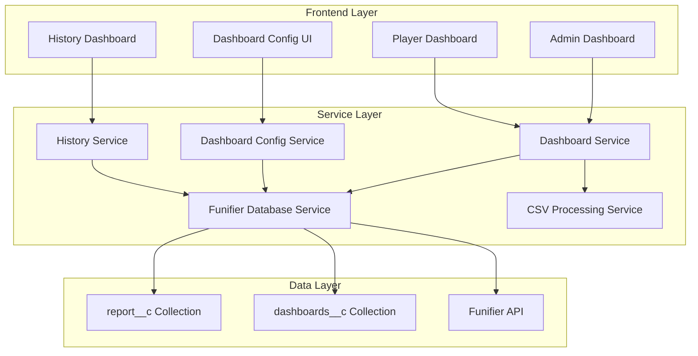

# Design Document

## Overview

This design implements two interconnected features for the Funifier gamification system: a cycle-based history function and a dynamic dashboard metrics configuration system. The solution extends the existing architecture with new database collections, services, and UI components while maintaining backward compatibility and system integrity.

## Architecture

### High-Level Architecture



### Data Flow

1. **Admin uploads data** → CSV Processing → Enhanced with cycle info → Stored in report__c
2. **Player views dashboard** → Dashboard Service → Applies current config → Renders with cycle data
3. **Player views history** → History Service → Fetches cycle data → Renders historical view
4. **Admin configures dashboards** → Dashboard Config Service → Stores in dashboards__c → Updates system behavior

## Components and Interfaces

### 1. History Service

```typescript
export interface CycleHistoryData {
  cycleNumber: number;
  startDate: string;
  endDate: string;
  totalDays: number;
  completionStatus: 'completed' | 'in_progress';
  finalMetrics: {
    primaryGoal: MetricSnapshot;
    secondaryGoal1: MetricSnapshot;
    secondaryGoal2: MetricSnapshot;
  };
  progressTimeline: ProgressDataPoint[];
}

export interface MetricSnapshot {
  name: string;
  percentage: number;
  target: number;
  current: number;
  unit: string;
  boostActive: boolean;
}

export interface ProgressDataPoint {
  date: string;
  dayInCycle: number;
  metrics: Record<string, number>;
  uploadSequence: number;
}

export class HistoryService {
  async getPlayerCycleHistory(playerId: string): Promise<CycleHistoryData[]>
  async getCycleDetails(playerId: string, cycleNumber: number): Promise<CycleHistoryData>
  async getCycleProgressTimeline(playerId: string, cycleNumber: number): Promise<ProgressDataPoint[]>
}
```

### 2. Dashboard Configuration Service

```typescript
export interface DashboardMetricConfig {
  name: string;
  displayName: string;
  challengeId: string;
  actionId: string;
  emoji: string;
  unit: string;
  calculationType: 'funifier_direct' | 'local_processing';
}

export interface BoostConfig {
  catalogItemId: string;
  name: string;
  description: string;
}

export interface DashboardConfig {
  teamType: TeamType;
  displayName: string;
  primaryGoal: DashboardMetricConfig;
  secondaryGoal1: DashboardMetricConfig & { boost: BoostConfig };
  secondaryGoal2: DashboardMetricConfig & { boost: BoostConfig };
  unlockConditions: {
    catalogItemId: string;
    description: string;
  };
  specialProcessing?: {
    type: 'carteira_ii_local';
    description: string;
    warnings: string[];
  };
}

export interface DashboardConfigurationRecord {
  _id: string;
  version: number;
  createdAt: string;
  createdBy: string;
  configurations: Record<TeamType, DashboardConfig>;
  isActive: boolean;
}

export class DashboardConfigurationService {
  async getCurrentConfiguration(): Promise<DashboardConfigurationRecord>
  async saveConfiguration(config: DashboardConfigurationRecord): Promise<void>
  async getConfigurationHistory(): Promise<DashboardConfigurationRecord[]>
  async validateConfiguration(config: DashboardConfigurationRecord): Promise<ValidationResult>
}
```

### 3. Enhanced Data Models

```typescript
// Extended EssenciaReportRecord with cycle support
export interface CycleAwareReportRecord extends EssenciaReportRecord {
  cycleNumber: number;
  uploadSequence: number; // For tracking multiple uploads within a cycle
  cycleStartDate: string;
  cycleEndDate: string;
}

// Enhanced CSV processing with cycle support
export interface CycleCSVData extends CSVGoalData {
  cycleNumber: number;
  uploadSequence: number;
  uploadTimestamp: string;
}

// Precision-fixed percentage handling
export interface PrecisionMetric {
  value: number;
  displayValue: string; // Pre-formatted for display
  rawCalculation: number; // Original calculation for debugging
}
```

## Data Models

### 1. Cycle History Collection (report__c - Enhanced)

```json
{
  "_id": "unique_id",
  "playerId": "player_id",
  "playerName": "Player Name",
  "team": "CARTEIRA_I",
  "cycleNumber": 2,
  "uploadSequence": 3,
  "cycleStartDate": "2024-01-01T00:00:00Z",
  "cycleEndDate": "2024-01-21T23:59:59Z",
  "atividade": 85.2,
  "reaisPorAtivo": 92.7,
  "faturamento": 78.1,
  "multimarcasPorAtivo": 95.3,
  "conversoes": 88.9,
  "upa": 91.2,
  "currentCycleDay": 15,
  "totalCycleDays": 21,
  "reportDate": "2024-01-15T10:30:00Z",
  "createdAt": "2024-01-15T10:30:00Z",
  "updatedAt": "2024-01-15T10:30:00Z"
}
```

### 2. Dashboard Configuration Collection (dashboards__c)

```json
{
  "_id": "config_id",
  "version": 1,
  "createdAt": "2024-01-01T00:00:00Z",
  "createdBy": "admin_user_id",
  "isActive": true,
  "configurations": {
    "CARTEIRA_I": {
      "teamType": "CARTEIRA_I",
      "displayName": "Carteira I",
      "primaryGoal": {
        "name": "atividade",
        "displayName": "Atividade",
        "challengeId": "E6FQIjs",
        "actionId": "atividade",
        "emoji": "🎯",
        "unit": "pontos",
        "calculationType": "funifier_direct"
      },
      "secondaryGoal1": {
        "name": "reaisPorAtivo",
        "displayName": "Reais por Ativo",
        "challengeId": "E6Gm8RI",
        "actionId": "reais_por_ativo",
        "emoji": "💰",
        "unit": "R$",
        "calculationType": "funifier_direct",
        "boost": {
          "catalogItemId": "E6F0WGc",
          "name": "Boost Reais por Ativo",
          "description": "Multiplicador ativo quando meta é atingida"
        }
      },
      "secondaryGoal2": {
        "name": "faturamento",
        "displayName": "Faturamento",
        "challengeId": "E6GglPq",
        "actionId": "faturamento",
        "emoji": "📈",
        "unit": "R$",
        "calculationType": "funifier_direct",
        "boost": {
          "catalogItemId": "E6K79Mt",
          "name": "Boost Faturamento",
          "description": "Multiplicador ativo quando meta é atingida"
        }
      },
      "unlockConditions": {
        "catalogItemId": "E6F0O5f",
        "description": "Pontos desbloqueados quando condições são atendidas"
      }
    },
    "CARTEIRA_II": {
      "teamType": "CARTEIRA_II",
      "displayName": "Carteira II",
      "specialProcessing": {
        "type": "carteira_ii_local",
        "description": "Processamento local devido à volatilidade da meta principal",
        "warnings": [
          "Esta carteira usa cálculos locais em vez de dados diretos da Funifier",
          "Mudanças nas métricas podem afetar a lógica de processamento local",
          "Boosts são calculados localmente e não sincronizados com a Funifier"
        ]
      },
      "primaryGoal": {
        "name": "reaisPorAtivo",
        "displayName": "Reais por Ativo",
        "challengeId": "E6MTIIK",
        "actionId": "reais_por_ativo",
        "emoji": "💰",
        "unit": "R$",
        "calculationType": "local_processing"
      }
      // ... rest of configuration
    }
  }
}
```

## Error Handling

### 1. Percentage Precision Fix

```typescript
export class PrecisionMath {
  /**
   * Fix floating-point precision issues in percentage calculations
   * Replicates the working approach from Carteira I implementation
   */
  static calculatePercentage(current: number, target: number): PrecisionMetric {
    if (target === 0) {
      return {
        value: 0,
        displayValue: '0%',
        rawCalculation: 0
      };
    }
    
    // Use the same approach as working Carteira I implementation
    const rawCalculation = (current / target) * 100;
    
    // Round to 1 decimal place for calculations
    const roundedValue = Math.round(rawCalculation * 10) / 10;
    
    // Format for display (no decimals for whole numbers)
    const displayValue = roundedValue % 1 === 0 
      ? `${Math.round(roundedValue)}%`
      : `${roundedValue}%`;
    
    return {
      value: roundedValue,
      displayValue,
      rawCalculation
    };
  }
}
```

### 2. Cycle Data Migration

```typescript
export class CycleMigrationService {
  /**
   * Handle existing data without cycle information
   */
  async migrateExistingData(): Promise<void> {
    // Assign cycle 1 to all existing data without cycle info
    const existingData = await this.databaseService.getReportData({
      cycleNumber: { $exists: false }
    });
    
    for (const record of existingData) {
      await this.databaseService.updateRecord(record._id, {
        cycleNumber: 1,
        uploadSequence: 1,
        cycleStartDate: record.createdAt,
        cycleEndDate: this.calculateCycleEnd(record.createdAt, record.totalCycleDays || 21)
      });
    }
  }
}
```

### 3. Configuration Validation

```typescript
export interface ValidationResult {
  isValid: boolean;
  errors: ValidationError[];
  warnings: ValidationWarning[];
}

export interface ValidationError {
  field: string;
  message: string;
  severity: 'error' | 'warning';
}

export class ConfigurationValidator {
  validateDashboardConfig(config: DashboardConfig): ValidationResult {
    const errors: ValidationError[] = [];
    
    // Validate Carteira II special requirements
    if (config.teamType === TeamType.CARTEIRA_II) {
      if (config.primaryGoal.calculationType !== 'local_processing') {
        errors.push({
          field: 'primaryGoal.calculationType',
          message: 'Carteira II must use local_processing for primary goal',
          severity: 'error'
        });
      }
    }
    
    // Validate challenge IDs exist
    // Validate boost configurations
    // Validate metric compatibility
    
    return {
      isValid: errors.filter(e => e.severity === 'error').length === 0,
      errors,
      warnings: []
    };
  }
}
```

## Testing Strategy

### 1. Unit Tests

- **PrecisionMath**: Test floating-point calculation fixes
- **HistoryService**: Test cycle data retrieval and formatting
- **ConfigurationService**: Test configuration validation and storage
- **CycleMigrationService**: Test backward compatibility handling

### 2. Integration Tests

- **End-to-end cycle workflow**: Admin upload → Player view → History access
- **Configuration changes**: Admin config → Dashboard updates → Player experience
- **Data migration**: Existing data → Cycle-aware system
- **Carteira II special handling**: Configuration changes → Local processing updates

### 3. Performance Tests

- **History data loading**: Large datasets with multiple cycles
- **Configuration caching**: Frequent dashboard loads with config changes
- **Database queries**: Optimized aggregation for cycle data

### 4. User Acceptance Tests

- **Player history navigation**: Intuitive cycle selection and data viewing
- **Admin configuration**: Clear warnings for Carteira II, validation feedback
- **Dashboard consistency**: Smooth transition between configurations
- **Data accuracy**: Percentage precision across all interfaces

## Implementation Phases

### Phase 1: Core Infrastructure
1. Extend data models with cycle support
2. Implement PrecisionMath utility
3. Create dashboard configuration service
4. Set up dashboards__c collection

### Phase 2: History Functionality
1. Implement HistoryService
2. Create history UI components
3. Update QuickActions to enable history button
4. Add cycle data visualization

### Phase 3: Configuration Interface
1. Create admin configuration UI
2. Implement configuration validation
3. Add Carteira II special handling
4. Create configuration management interface

### Phase 4: Enhanced Details & Integration
1. Update GoalDetailsAccordion with real metric values
2. Apply configuration changes to all dashboard components
3. Implement data migration for existing records
4. Add comprehensive error handling and logging

This design ensures a robust, scalable solution that maintains system integrity while adding powerful new functionality for both players and administrators.