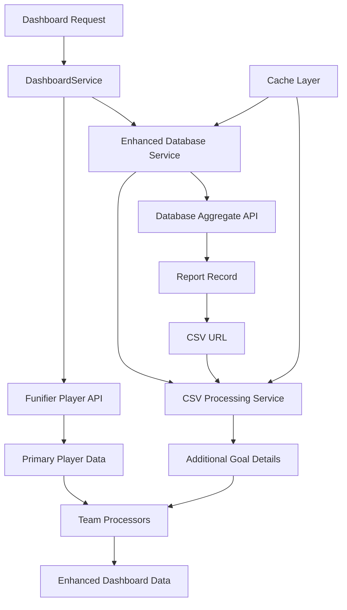

# Enhanced Database Integration Design

## Overview

This design implements a comprehensive database integration system that enhances the existing dashboard with detailed goal metrics. The system uses the Funifier database aggregate API to fetch report records and associated CSV files, providing users with complete goal information including targets, current values, percentages, and deadlines.

## Architecture

### High-Level Architecture



### Data Flow

1. **Primary Path**: Funifier API → Basic Metrics → Dashboard
2. **Enhancement Path**: Database → CSV → Additional Details → Enhanced Dashboard
3. **Hybrid Path**: Funifier API + Database (for missing info) → Complete Metrics → Dashboard

## Components and Interfaces

### 1. Enhanced Database Service

```typescript
interface EnhancedDatabaseService {
  // Existing methods
  getLatestPlayerReport(playerId: string): Promise<EssenciaReportRecord | null>;
  
  // New methods
  getDetailedPlayerReport(playerId: string): Promise<DetailedReportRecord | null>;
  fetchReportCSV(csvUrl: string): Promise<CSVGoalData | null>;
  aggregatePlayerData(playerId: string): Promise<DatabaseAggregateResult>;
}

interface DatabaseAggregateResult {
  _id: string;
  playerId: string;
  reaisPorAtivoPercentual: number;
  diaDociclo: number;
  totalDiasCiclo: number;
  faturamentoPercentual: number;
  atividadePercentual: number;
  multimarcasPorAtivoPercentual: number;
  uploadUrl?: string;
  reportDate: string;
  createdAt: string;
  updatedAt: string;
  status: string;
}
```

### 2. CSV Processing Service

```typescript
interface CSVProcessingService {
  parseGoalCSV(csvContent: string): Promise<CSVGoalData>;
  downloadAndParseCSV(url: string): Promise<CSVGoalData | null>;
  validateCSVStructure(data: any[]): boolean;
}

interface CSVGoalData {
  playerId: string;
  cycleDay: number;
  totalCycleDays: number;
  goals: {
    faturamento: GoalDetails;
    reaisPorAtivo: GoalDetails;
    multimarcasPorAtivo: GoalDetails;
    atividade: GoalDetails;
  };
}

interface GoalDetails {
  target: number;
  current: number;
  percentage: number;
  unit?: string;
}
```

### 3. Enhanced Types

```typescript
interface DetailedReportRecord extends EssenciaReportRecord {
  csvData?: CSVGoalData;
  hasDetailedMetrics: boolean;
}

interface EnhancedGoalMetric extends GoalMetric {
  target?: number;
  current?: number;
  unit?: string;
  daysRemaining?: number;
}

interface EnhancedDashboardData extends DashboardData {
  primaryGoal: EnhancedDashboardGoal;
  secondaryGoal1: EnhancedDashboardGoal & { hasBoost: true };
  secondaryGoal2: EnhancedDashboardGoal & { hasBoost: true };
}

interface EnhancedDashboardGoal extends DashboardGoal {
  target?: number;
  current?: number;
  unit?: string;
  daysRemaining?: number;
  hasDetailedData: boolean;
}
```

### 4. Database Authentication Service

```typescript
interface DatabaseAuthService {
  getAuthHeaders(): Record<string, string>;
  validateConnection(): Promise<boolean>;
}
```

## Data Models

### Database Aggregate Query

```javascript
// MongoDB aggregate query for latest player report
[
  {
    "$match": {
      "playerId": "{{playerId}}",
      "status": "REGISTERED"
    }
  },
  {
    "$sort": {
      "createdAt": -1
    }
  },
  {
    "$limit": 1
  }
]
```

### CSV Column Mapping

```typescript
const CSV_COLUMN_MAPPING = {
  'Player ID': 'playerId',
  'Dia do Ciclo': 'cycleDay',
  'Total Dias Ciclo': 'totalCycleDays',
  'Faturamento Meta': 'faturamento.target',
  'Faturamento Atual': 'faturamento.current',
  'Faturamento %': 'faturamento.percentage',
  'Reais por Ativo Meta': 'reaisPorAtivo.target',
  'Reais por Ativo Atual': 'reaisPorAtivo.current',
  'Reais por Ativo %': 'reaisPorAtivo.percentage',
  'Multimarcas por Ativo Meta': 'multimarcasPorAtivo.target',
  'Multimarcas por Ativo Atual': 'multimarcasPorAtivo.current',
  'Multimarcas por Ativo %': 'multimarcasPorAtivo.percentage',
  'Atividade Meta': 'atividade.target',
  'Atividade Atual': 'atividade.current',
  'Atividade %': 'atividade.percentage'
};
```

## Error Handling

### Error Types

```typescript
enum DatabaseErrorType {
  AUTHENTICATION_FAILED = 'AUTHENTICATION_FAILED',
  AGGREGATE_QUERY_FAILED = 'AGGREGATE_QUERY_FAILED',
  CSV_DOWNLOAD_FAILED = 'CSV_DOWNLOAD_FAILED',
  CSV_PARSING_FAILED = 'CSV_PARSING_FAILED',
  DATA_VALIDATION_FAILED = 'DATA_VALIDATION_FAILED'
}
```

### Error Handling Strategy

1. **Database Connection Errors**: Log error, use Funifier API fallback
2. **CSV Download Errors**: Log error, use database percentages only
3. **CSV Parsing Errors**: Log error with context, use available data
4. **Data Validation Errors**: Log error, use safe defaults
5. **Timeout Errors**: Use cached data if available, otherwise fallback

## Testing Strategy

### Unit Tests

1. **Database Service Tests**
   - Authentication header generation
   - Aggregate query construction
   - Response parsing and validation
   - Error handling scenarios

2. **CSV Processing Tests**
   - CSV parsing with valid data
   - CSV parsing with malformed data
   - Column mapping validation
   - Data type conversion

3. **Integration Tests**
   - End-to-end data flow
   - Fallback mechanism testing
   - Cache behavior validation
   - Performance under load

### Test Data

```typescript
const MOCK_DATABASE_RESPONSE = {
  "_id": "68c68ca3b907ef364c4d4c28",
  "playerId": "123456",
  "reaisPorAtivoPercentual": 25,
  "diaDociclo": 12,
  "totalDiasCiclo": 21,
  "faturamentoPercentual": 50,
  "atividadePercentual": 88,
  "multimarcasPorAtivoPercentual": 65,
  "uploadUrl": "https://s3.amazonaws.com/funifier/games/[api_key]/reports/68c68ca3b907ef364c4d4c2a_taira-rabelo-test.csv",
  "reportDate": "2025-09-14",
  "createdAt": "2025-09-14T09:36:34.688Z",
  "status": "REGISTERED"
};

const MOCK_CSV_DATA = `Player ID,Dia do Ciclo,Total Dias Ciclo,Faturamento Meta,Faturamento Atual,Faturamento %,Reais por Ativo Meta,Reais por Ativo Atual,Reais por Ativo %,Multimarcas por Ativo Meta,Multimarcas por Ativo Atual,Multimarcas por Ativo %,Atividade Meta,Atividade Atual,Atividade %
123456,12,21,400000,200000,50,1300,325,25,2,1.3,65,41,36,88`;
```

## Performance Considerations

### Caching Strategy

1. **Database Records**: 5-minute TTL for report records
2. **CSV Data**: 15-minute TTL for parsed CSV data
3. **Failed Requests**: 1-minute TTL for failed requests to prevent spam
4. **Background Refresh**: Refresh cache in background when 80% of TTL elapsed

### Optimization Techniques

1. **Parallel Processing**: Fetch database record and CSV simultaneously when possible
2. **Lazy Loading**: Only fetch CSV when detailed view is requested
3. **Request Deduplication**: Prevent multiple simultaneous requests for same data
4. **Compression**: Use gzip compression for CSV downloads
5. **Connection Pooling**: Reuse HTTP connections for database requests

## Security Considerations

### Authentication

1. **Token Security**: Store database auth token securely in environment variables
2. **Request Validation**: Validate all database responses before processing
3. **URL Validation**: Validate CSV URLs before downloading to prevent SSRF attacks
4. **Data Sanitization**: Sanitize all CSV data before processing

### Privacy

1. **Data Minimization**: Only fetch required player data
2. **Logging**: Avoid logging sensitive player information
3. **Error Messages**: Provide generic error messages to users
4. **Data Retention**: Follow data retention policies for cached information

## Migration Strategy

### Phase 1: Infrastructure Setup
- Implement database authentication service
- Create enhanced database service with aggregate API
- Add CSV processing service
- Update type definitions

### Phase 2: Core Integration
- Enhance team processors to use detailed data
- Update dashboard service to fetch enhanced data
- Implement fallback mechanisms
- Add comprehensive error handling

### Phase 3: UI Enhancement
- Update goal cards to display detailed information
- Enhance goal details accordion with new data
- Add loading states for CSV processing
- Implement error states for failed data fetching

### Phase 4: Testing and Optimization
- Comprehensive testing of all scenarios
- Performance optimization and caching
- Monitoring and alerting setup
- Documentation and training

## Monitoring and Observability

### Metrics to Track

1. **Database Request Success Rate**: Percentage of successful database requests
2. **CSV Processing Success Rate**: Percentage of successful CSV downloads and parsing
3. **Fallback Usage Rate**: How often fallback mechanisms are used
4. **Response Times**: Database and CSV processing response times
5. **Cache Hit Rates**: Effectiveness of caching strategy

### Logging Strategy

1. **Structured Logging**: Use structured logs for better analysis
2. **Correlation IDs**: Track requests across services
3. **Performance Logs**: Log timing information for optimization
4. **Error Context**: Include relevant context in error logs
5. **User Actions**: Log user interactions for debugging