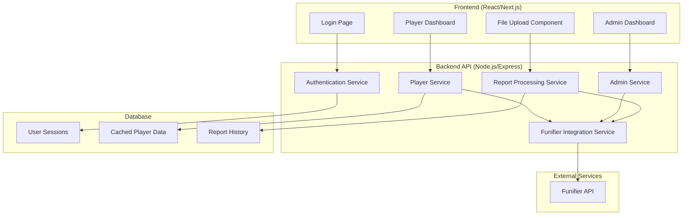

# Design Document

## Overview

O sistema será uma aplicação web moderna que integra com a API da Funifier para fornecer dashboards personalizados de gamificação para o grupo Essência (distribuidora do Boticário). A arquitetura seguirá o padrão de Single Page Application (SPA) com backend API para gerenciar a integração com a Funifier e processamento de dados específicos.

## Architecture

### High-Level Architecture



### Technology Stack

**Frontend:**
- React.js com Next.js para SSR e otimização
- TypeScript para type safety
- Tailwind CSS para styling responsivo
- React Query para gerenciamento de estado e cache
- Chart.js ou Recharts para visualizações

**Backend:**
- Node.js com Express.js
- TypeScript
- Axios para requisições HTTP à Funifier API
- JWT para autenticação
- Redis para cache (opcional)
- SQLite ou PostgreSQL para persistência local

## UI/UX Design Specifications

### Visual Design System
- **Color Palette**: O Boticário brand colors
  - Primary Pink: #E91E63
  - Primary Purple: #9C27B0  
  - Gold (boosts): #FFD700
  - Light background: #FCE4EC
  - Dark accent: #880E4F
- **Typography**: Poppins font family
- **Layout**: Card-based design with rounded corners and shadows
- **Animations**: Pulse effects for active states, glow effects for boosts

### Progress Bar Specifications
```typescript
interface ProgressBarVisual {
  // Regra especial das barras de progresso:
  // 0-50%: cor vermelha, preenche 0-33.33% da barra visual
  // 50-100%: cor amarela, preenche 33.33-66.66% da barra visual  
  // 100-150%: cor verde, preenche 66.66-100% da barra visual
  percentage: number; // Valor real da meta (0-150+)
  visualFill: number; // Preenchimento visual da barra (0-100%)
  color: 'red' | 'yellow' | 'green';
  gradient: string; // CSS gradient baseado na cor
}
```

### Dashboard Layout Structure
1. **Header**: Gradient background com logo e saudação personalizada
2. **Points Card**: Status de pontos com indicador visual de bloqueio/desbloqueio
3. **Cycle Info**: Dia atual e dias restantes do ciclo
4. **Primary Goal**: Meta principal com destaque visual maior
5. **Secondary Goals**: Duas metas secundárias com indicadores de boost
6. **Details Accordion**: Informações expandidas das metas

## Components and Interfaces

### Frontend Components

#### 1. Authentication Components
```typescript
interface LoginProps {
  onLogin: (credentials: LoginCredentials) => Promise<void>;
}

interface LoginCredentials {
  username: string;
  password: string;
}

interface AuthContext {
  user: User | null;
  isPlayer: boolean;
  isAdmin: boolean;
  team: TeamType;
  login: (credentials: LoginCredentials) => Promise<void>;
  logout: () => void;
}
```

#### 2. Player Dashboard Components
```typescript
interface PlayerDashboardProps {
  playerId: string;
  team: TeamType;
}

interface PlayerMetrics {
  playerName: string;
  totalPoints: number;
  pointsLocked: boolean;
  currentCycleDay: number;
  daysUntilCycleEnd: number;
  primaryGoal: GoalMetric;
  secondaryGoal1: GoalMetric;
  secondaryGoal2: GoalMetric;
}

interface GoalMetric {
  name: string;
  percentage: number; // Vem da collection customizada
  boostActive?: boolean; // Baseado em catalog_items
  details: Record<string, any>;
}

interface ProgressBarConfig {
  // Barra de progresso especial:
  // 0-50%: vermelho, cresce até 1/3 da barra
  // 50-100%: amarelo, cresce de 1/3 até 2/3 da barra  
  // 100-150%: verde, cresce de 2/3 até barra completa
  percentage: number;
  color: 'red' | 'yellow' | 'green';
  fillPercentage: number; // Porcentagem visual da barra (0-100)
}

enum TeamType {
  CARTEIRA_I = 'CARTEIRA_I',
  CARTEIRA_II = 'CARTEIRA_II',
  CARTEIRA_III = 'CARTEIRA_III',
  CARTEIRA_IV = 'CARTEIRA_IV'
}
```

#### 3. Admin Dashboard Components
```typescript
interface AdminDashboardProps {
  onPlayerSelect: (playerId: string) => void;
  onExportData: () => void;
  onUploadReport: (file: File) => Promise<void>;
}

interface PlayerSelector {
  players: Player[];
  selectedPlayer: Player | null;
  onSelect: (player: Player) => void;
}

interface ReportUpload {
  onFileSelect: (file: File) => void;
  onUpload: () => Promise<UploadResult>;
  isUploading: boolean;
}
```

### Backend API Interfaces

#### 1. Funifier Integration Service
```typescript
interface FunifierService {
  authenticate(username: string, password: string): Promise<string>;
  getPlayerStatus(playerId: string): Promise<FunifierPlayerStatus>;
  createCustomCollection(collectionName: string, data: any[]): Promise<void>;
  getCollectionData(collectionName: string): Promise<any[]>;
  aggregateCollectionData(collectionName: string, pipeline: any[]): Promise<any[]>;
  sendActionLog(actionLog: ActionLog): Promise<void>;
}

// Baseado na resposta real da API Funifier
interface FunifierPlayerStatus {
  name: string;
  image?: {
    small: ImageInfo;
    medium: ImageInfo;
    original: ImageInfo;
  };
  total_challenges: number;
  challenges: Record<string, number>; // challengeId -> count
  total_points: number;
  point_categories: Record<string, number>;
  total_catalog_items: number;
  catalog_items: Record<string, number>;
  level_progress: {
    percent_completed: number;
    next_points: number;
    total_levels: number;
    percent: number;
  };
  challenge_progress: any[];
  teams: string[]; // Array de team IDs
  positions: any[];
  time: number;
  extra: Record<string, any>;
  pointCategories: Record<string, number>;
  _id: string;
}

interface ImageInfo {
  url: string;
  size: number;
  width: number;
  height: number;
  depth: number;
}

interface ActionLog {
  playerId: string;
  challengeType: string;
  attribute: string;
  value: number;
  timestamp: Date;
}

// Configuração da API Funifier
const FUNIFIER_CONFIG = {
  API_KEY: process.env.FUNIFIER_API_KEY,
  BASE_URL: 'https://service2.funifier.com/v3',
  CUSTOM_COLLECTION: 'essencia_reports__c',
  CATALOG_ITEMS: {
    UNLOCK_POINTS: 'E6F0O5f', // Se > 0, pontos desbloqueados (Carteiras I, III, IV)
    LOCK_POINTS: 'E6F0MJ3', // Item de bloqueio
    BOOST_SECONDARY_1: 'E6F0WGc', // Boost meta secundária 1
    BOOST_SECONDARY_2: 'E6K79Mt'  // Boost meta secundária 2
  }
};
```

#### 2. Team-Specific Processing
```typescript
interface TeamProcessor {
  processPlayerData(rawData: FunifierPlayerStatus, reportData?: EssenciaReportRecord): PlayerMetrics;
}

class CarteiraIProcessor implements TeamProcessor {
  processPlayerData(rawData: FunifierPlayerStatus, reportData?: EssenciaReportRecord): PlayerMetrics {
    // Meta principal: Atividade (porcentagem vem da collection)
    // Meta secundária 1: Reais por ativo (porcentagem vem da collection)
    // Meta secundária 2: Faturamento (porcentagem vem da collection)
    // Pontos vêm de total_points, bloqueio baseado em catalog_items
    
    return {
      playerName: rawData.name,
      totalPoints: rawData.total_points,
      pointsLocked: this.calculatePointsLocked(rawData.catalog_items),
      currentCycleDay: reportData?.currentCycleDay || this.getCurrentCycleDay(),
      daysUntilCycleEnd: this.getDaysUntilCycleEnd(reportData),
      primaryGoal: this.createAtividadeGoal(reportData, rawData.catalog_items),
      secondaryGoal1: this.createReaisPorAtivoGoal(reportData, rawData.catalog_items),
      secondaryGoal2: this.createFaturamentoGoal(reportData, rawData.catalog_items)
    };
  }
  
  private calculatePointsLocked(catalogItems: Record<string, number>): boolean {
    // Se tem o item E6F0O5f com quantidade > 0, pontos estão desbloqueados
    return (catalogItems[FUNIFIER_CONFIG.CATALOG_ITEMS.UNLOCK_POINTS] || 0) === 0;
  }
  
  private createAtividadeGoal(reportData?: EssenciaReportRecord, catalogItems?: Record<string, number>): GoalMetric {
    const percentage = reportData?.atividade || 0;
    
    return {
      name: 'Atividade',
      percentage,
      boostActive: false, // Carteira I não tem boost na meta principal
      details: { 
        progressBar: this.calculateProgressBar(percentage)
      }
    };
  }
  
  private createReaisPorAtivoGoal(reportData?: EssenciaReportRecord, catalogItems?: Record<string, number>): GoalMetric {
    const percentage = reportData?.reaisPorAtivo || 0;
    const boostActive = (catalogItems?.[FUNIFIER_CONFIG.CATALOG_ITEMS.BOOST_SECONDARY_1] || 0) > 0;
    
    return {
      name: 'Reais por Ativo',
      percentage,
      boostActive,
      details: { 
        progressBar: this.calculateProgressBar(percentage)
      }
    };
  }
  
  private calculateProgressBar(percentage: number): ProgressBarConfig {
    if (percentage <= 50) {
      return {
        percentage,
        color: 'red',
        fillPercentage: (percentage / 50) * 33.33 // 0-50% -> 0-33.33% da barra
      };
    } else if (percentage <= 100) {
      return {
        percentage,
        color: 'yellow', 
        fillPercentage: 33.33 + ((percentage - 50) / 50) * 33.33 // 50-100% -> 33.33-66.66% da barra
      };
    } else {
      return {
        percentage,
        color: 'green',
        fillPercentage: 66.66 + ((Math.min(percentage, 150) - 100) / 50) * 33.34 // 100-150% -> 66.66-100% da barra
      };
    }
  }
}

class CarteiraIIProcessor implements TeamProcessor {
  processPlayerData(rawData: FunifierPlayerStatus, reportData?: EssenciaReportRecord): PlayerMetrics {
    // Meta principal: Reais por ativo (porcentagem da collection + cálculos locais)
    // Meta secundária 1: Atividade (porcentagem da collection)
    // Meta secundária 2: Multimarcas por ativo (porcentagem da collection)
    // Pontos base da Funifier + processamento local de bloqueio/desbloqueio e boosts
    
    const basePoints = rawData.total_points;
    const processedPoints = this.processCarteiraIIPoints(basePoints, reportData, rawData.catalog_items);
    
    return {
      playerName: rawData.name,
      totalPoints: processedPoints.total,
      pointsLocked: processedPoints.locked,
      currentCycleDay: reportData?.currentCycleDay || this.getCurrentCycleDay(),
      daysUntilCycleEnd: this.getDaysUntilCycleEnd(reportData),
      primaryGoal: this.createReaisPorAtivoGoalLocal(reportData),
      secondaryGoal1: this.createAtividadeGoal(reportData, rawData.catalog_items),
      secondaryGoal2: this.createMultimarcasPorAtivoGoal(reportData, rawData.catalog_items)
    };
  }
  
  private processCarteiraIIPoints(basePoints: number, reportData?: EssenciaReportRecord, catalogItems?: Record<string, number>) {
    const reaisPorAtivoPercentage = reportData?.reaisPorAtivo || 0;
    
    // Pontos desbloqueiam se Reais por Ativo >= 100%
    const pointsUnlocked = reaisPorAtivoPercentage >= 100;
    
    if (!pointsUnlocked) {
      return {
        total: basePoints,
        locked: true
      };
    }
    
    // Calcular multiplicadores de boost
    let multiplier = 1;
    const hasBoost1 = (catalogItems?.[FUNIFIER_CONFIG.CATALOG_ITEMS.BOOST_SECONDARY_1] || 0) > 0;
    const hasBoost2 = (catalogItems?.[FUNIFIER_CONFIG.CATALOG_ITEMS.BOOST_SECONDARY_2] || 0) > 0;
    
    if (hasBoost1) multiplier += 1; // +100%
    if (hasBoost2) multiplier += 1; // +100% adicional
    
    return {
      total: Math.round(basePoints * multiplier),
      locked: false
    };
  }
  
  private createReaisPorAtivoGoalLocal(reportData?: EssenciaReportRecord): GoalMetric {
    const percentage = reportData?.reaisPorAtivo || 0;
    
    return {
      name: 'Reais por Ativo',
      percentage,
      boostActive: false, // Meta principal não tem boost visual
      details: { 
        progressBar: this.calculateProgressBar(percentage),
        isUnlockGoal: true // Indica que esta meta controla o desbloqueio de pontos
      }
    };
  }
}

class CarteiraIIIIVProcessor implements TeamProcessor {
  processPlayerData(rawData: FunifierPlayerStatus, reportData?: EssenciaReportRecord): PlayerMetrics {
    // Meta principal: Faturamento (vem dos challenges da Funifier)
    // Meta secundária 1: Reais por ativo (vem dos challenges da Funifier)
    // Meta secundária 2: Multimarcas por ativo (vem dos challenges da Funifier)
    // Pontos e bloqueio vêm diretamente da Funifier
    
    return {
      playerName: rawData.name,
      totalPoints: rawData.total_points,
      pointsLocked: this.calculatePointsLocked(rawData),
      currentCycleDay: this.getCurrentCycleDay(),
      daysUntilCycleEnd: this.getDaysUntilCycleEnd(),
      primaryGoal: this.extractFaturamentoGoal(rawData),
      secondaryGoal1: this.extractReaisPorAtivoGoal(rawData),
      secondaryGoal2: this.extractMultimarcasPorAtivoGoal(rawData)
    };
  }
}
```

## Data Models

### Core Data Models

```typescript
interface User {
  id: string;
  username: string;
  role: 'player' | 'admin';
  team?: TeamType;
  name: string;
}

interface Player {
  id: string;
  name: string;
  team: TeamType;
  isActive: boolean;
}

interface Challenge {
  id: string;
  name: string;
  type: 'atividade' | 'reais_por_ativo' | 'faturamento' | 'multimarcas_por_ativo';
  team: TeamType;
  isActive: boolean;
}

interface CycleInfo {
  currentDay: number;
  totalDays: number;
  startDate: Date;
  endDate: Date;
}

interface PlayerChallenge {
  challengeId: string;
  playerId: string;
  currentValue: number;
  targetValue: number;
  percentage: number;
  boostActive: boolean;
  boostMultiplier?: number;
}
```

### Report Processing Models

```typescript
interface ReportData {
  playerId: string;
  playerName: string;
  team: TeamType;
  metrics: {
    atividade?: number;
    reaisPorAtivo?: number;
    faturamento?: number;
    multimarcasPorAtivo?: number;
  };
  reportDate: Date;
}

interface ComparisonResult {
  playerId: string;
  differences: MetricDifference[];
  actionLogs: ActionLog[];
}

interface MetricDifference {
  metric: string;
  funifierValue: number;
  reportValue: number;
  difference: number;
  requiresUpdate: boolean;
}

// Estrutura para armazenar na collection customizada da Funifier
interface EssenciaReportRecord {
  _id: string; // playerId + reportDate
  playerId: string;
  playerName: string;
  team: TeamType;
  atividade?: number; // Porcentagem da meta (0-150+)
  reaisPorAtivo?: number; // Porcentagem da meta (0-150+)
  faturamento?: number; // Porcentagem da meta (0-150+)
  multimarcasPorAtivo?: number; // Porcentagem da meta (0-150+)
  currentCycleDay?: number; // Dia atual do ciclo
  totalCycleDays?: number; // Total de dias no ciclo (padrão: 21)
  reportDate: string; // ISO date string
  createdAt: string;
  updatedAt: string;
}
```

## Error Handling

### API Error Handling Strategy

```typescript
enum ErrorType {
  AUTHENTICATION_ERROR = 'AUTHENTICATION_ERROR',
  FUNIFIER_API_ERROR = 'FUNIFIER_API_ERROR',
  DATA_PROCESSING_ERROR = 'DATA_PROCESSING_ERROR',
  VALIDATION_ERROR = 'VALIDATION_ERROR',
  NETWORK_ERROR = 'NETWORK_ERROR'
}

interface ApiError {
  type: ErrorType;
  message: string;
  details?: any;
  timestamp: Date;
}

class ErrorHandler {
  static handleFunifierError(error: any): ApiError;
  static handleValidationError(error: any): ApiError;
  static handleNetworkError(error: any): ApiError;
}
```

### Frontend Error Boundaries

```typescript
interface ErrorBoundaryState {
  hasError: boolean;
  error?: Error;
  errorInfo?: ErrorInfo;
}

class DashboardErrorBoundary extends Component<Props, ErrorBoundaryState> {
  // Captura erros específicos do dashboard
  // Exibe fallback UI apropriado
  // Log de erros para monitoramento
}
```

## Testing Strategy

### Unit Testing
- **Frontend**: Jest + React Testing Library
  - Componentes de dashboard
  - Hooks customizados
  - Utilitários de formatação
  
- **Backend**: Jest + Supertest
  - Services de integração com Funifier
  - Processadores específicos por time
  - Validação de dados

### Integration Testing
- Testes de integração com API Funifier (usando mocks)
- Testes de fluxo completo de upload de relatório
- Testes de autenticação e autorização

### E2E Testing
- Cypress para testes de fluxo de usuário
- Cenários críticos:
  - Login e redirecionamento baseado em role
  - Visualização de dashboard por time
  - Upload e processamento de relatório

### Performance Testing
- Testes de carga para endpoints críticos
- Monitoramento de tempo de resposta da API Funifier
- Otimização de queries e cache

## Funifier Integration Flow

### Authentication Flow
```typescript
class FunifierAuthService {
  async authenticate(username: string, password: string): Promise<string> {
    const response = await axios.post(`${FUNIFIER_CONFIG.BASE_URL}/v3/auth/token`, {
      apiKey: FUNIFIER_CONFIG.API_KEY,
      grant_type: 'password',
      username,
      password
    });
    
    return response.data.access_token;
  }
}
```

### Player Data Retrieval
```typescript
class FunifierPlayerService {
  async getPlayerStatus(playerId: string, token: string): Promise<FunifierPlayerStatus> {
    const response = await axios.get(
      `${FUNIFIER_CONFIG.BASE_URL}/player_status`,
      {
        headers: { Authorization: `Bearer ${token}` },
        params: { id: playerId }
      }
    );
    
    return response.data;
  }
}
```

### Report Data Management
```typescript
class FunifierReportService {
  async saveReportData(reportData: EssenciaReportRecord[], token: string): Promise<void> {
    // Cria/atualiza a collection customizada com dados do relatório
    await axios.post(
      `${FUNIFIER_CONFIG.BASE_URL}/v3/database/${FUNIFIER_CONFIG.CUSTOM_COLLECTION}/bulk`,
      reportData,
      {
        headers: { Authorization: `Bearer ${token}` }
      }
    );
  }
  
  async getStoredReportData(token: string): Promise<EssenciaReportRecord[]> {
    const response = await axios.get(
      `${FUNIFIER_CONFIG.BASE_URL}/v3/database/${FUNIFIER_CONFIG.CUSTOM_COLLECTION}`,
      {
        headers: { Authorization: `Bearer ${token}` }
      }
    );
    
    return response.data;
  }
  
  async compareReportData(playerId: string, newData: any, token: string): Promise<ComparisonResult> {
    // Usa aggregation para comparar dados atuais com novos dados
    const pipeline = [
      { $match: { playerId: playerId } },
      { $sort: { reportDate: -1 } },
      { $limit: 1 }
    ];
    
    const storedData = await axios.post(
      `${FUNIFIER_CONFIG.BASE_URL}/v3/database/${FUNIFIER_CONFIG.CUSTOM_COLLECTION}/aggregate?strict=true`,
      pipeline,
      {
        headers: { Authorization: `Bearer ${token}` }
      }
    );
    
    return this.calculateDifferences(storedData.data[0], newData);
  }
}
```

### Action Log Generation
```typescript
class FunifierActionLogService {
  async sendActionLog(actionLog: ActionLog, token: string): Promise<void> {
    // Envia action log para atualizar challenges na Funifier
    // Endpoint específico será definido baseado na documentação completa
    await axios.post(
      `${FUNIFIER_CONFIG.BASE_URL}/v3/action-logs`,
      actionLog,
      {
        headers: { Authorization: `Bearer ${token}` }
      }
    );
  }
}
```

## Security Considerations

### Authentication & Authorization
- JWT tokens com expiração apropriada
- Refresh token mechanism
- Role-based access control (RBAC)
- Rate limiting para APIs

### Data Protection
- Validação rigorosa de inputs
- Sanitização de dados de upload
- Logs de auditoria para ações administrativas
- Criptografia de dados sensíveis em trânsito

### API Security
- HTTPS obrigatório
- CORS configurado adequadamente
- Headers de segurança (HSTS, CSP, etc.)
- Validação de origem para uploads

## Performance Optimization

### Frontend Optimization
- Code splitting por rota
- Lazy loading de componentes
- Memoização de cálculos pesados
- Otimização de re-renders com React.memo

### Backend Optimization
- Cache de dados da Funifier (Redis)
- Connection pooling para database
- Compressão de responses
- Paginação para listagens grandes

### Data Management
- Cache inteligente baseado em TTL para dados da Funifier
- Uso da collection customizada `essencia_reports__c` na Funifier para persistir dados de relatórios
- Agregação de dados usando MongoDB pipeline na Funifier para comparações
- Invalidação de cache em updates
- Batch processing para action logs
- Otimização de queries de relatório

## Deployment Architecture

### Environment Configuration
- **Development**: Local com mocks da Funifier API
- **Staging**: Ambiente de teste com Funifier sandbox
- **Production**: Integração completa com Funifier

### Infrastructure
- Frontend: Vercel ou Netlify para deploy estático
- Backend: Docker containers em AWS/Azure
- Database: Managed database service
- Monitoring: Application insights e logging

### CI/CD Pipeline
- Automated testing em PRs
- Build e deploy automático
- Health checks pós-deploy
- Rollback automático em falhas