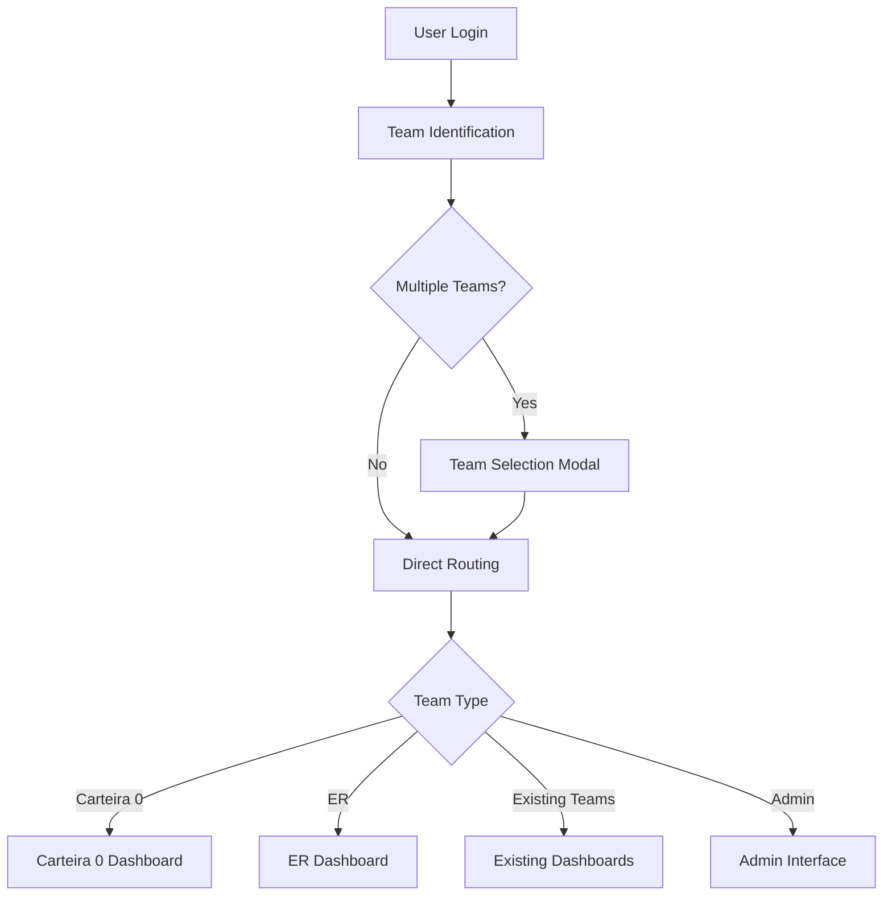

# Design Document

## Overview

This design extends the existing Funifier gamification dashboard system to support two new dashboard types: Carteira 0 and ER. The implementation leverages the current architecture while adding support for new metrics (Conversões and UPA) and enhanced team selection functionality. The design maintains consistency with existing dashboards while introducing minimal UI changes.

## Architecture

### Current System Analysis

The existing system follows a well-established pattern:
- **Team Processors**: Handle metric calculation and data processing per team type
- **Dashboard Factory**: Routes users to appropriate dashboard components based on team type
- **CSV Processing**: Handles report data import and validation
- **Authentication Flow**: Manages user login and team identification

### New Components Integration

The new dashboard types will integrate seamlessly into the existing architecture:



## Components and Interfaces

### 1. Type System Extensions

**New Team Types**
```typescript
enum TeamType {
  CARTEIRA_0 = 'CARTEIRA_0',
  CARTEIRA_I = 'CARTEIRA_I',
  CARTEIRA_II = 'CARTEIRA_II', 
  CARTEIRA_III = 'CARTEIRA_III',
  CARTEIRA_IV = 'CARTEIRA_IV',
  ER = 'ER'
}
```

**New Metric Types**
```typescript
interface ExtendedCSVGoalData extends CSVGoalData {
  conversoes?: {
    target: number;
    current: number;
    percentage: number;
  };
  upa?: {
    target: number;
    current: number;
    percentage: number;
  };
}
```

**Configuration Updates**
```typescript
const FUNIFIER_CONFIG = {
  // ... existing config
  TEAM_IDS: {
    // ... existing team IDs
    CARTEIRA_0: 'E6F5k30',
    ER: 'E500AbT'
  },
  ACTION_IDS: {
    // ... existing action IDs
    CONVERSOES: 'conversoes',
    UPA: 'upa'
  }
}
```

### 2. Team Processors

**Carteira 0 Processor**
- Extends BaseTeamProcessor
- Primary Goal: Conversões
- Secondary Goals: Reais por Ativo, Faturamento
- Uses existing boost logic and UI patterns

**ER Processor**
- Extends BaseTeamProcessor  
- Primary Goal: Faturamento
- Secondary Goals: Reais por Ativo, UPA
- Includes Medalhas button functionality

### 3. Dashboard Components

**Carteira 0 Dashboard**
- Reuses existing dashboard layout components
- Integrates Carteira 0 processor for data
- Identical UI to other Carteira dashboards

**ER Dashboard**
- Reuses existing dashboard layout components
- Integrates ER processor for data
- Adds Medalhas button alongside Histórico and Ranking
- Medalhas button shows "Em Breve" placeholder

### 4. Team Selection Modal

**Multi-Team Selection Interface**
```typescript
interface TeamSelectionModalProps {
  availableTeams: Array<{
    teamType: TeamType | 'ADMIN';
    displayName: string;
    teamId: string;
  }>;
  onTeamSelect: (selection: TeamType | 'ADMIN') => void;
  onClose: () => void;
}
```

**Modal Features**
- Uses existing UI design patterns
- Shows all available teams including Admin
- Handles team selection and routing
- Responsive design matching current modals

### 5. CSV Processing Enhancements

**Extended CSV Structure**
```
Player ID, Dia do Ciclo, Total Dias Ciclo, 
Faturamento Meta, Faturamento Atual, Faturamento %,
Reais por Ativo Meta, Reais por Ativo Atual, Reais por Ativo %,
Atividade Meta, Atividade Atual, Atividade %,
Multimarcas por Ativo Meta, Multimarcas por Ativo Atual, Multimarcas por Ativo %,
Conversões Meta, Conversões Atual, Conversões %,
UPA Meta, UPA Atual, UPA %
```

**Validation Updates**
- Backward compatibility with existing CSV format
- Optional validation for new metrics
- Clear error messages for missing required fields per team type

## Data Models

### 1. Enhanced Report Record

```typescript
interface ExtendedEssenciaReportRecord extends EssenciaReportRecord {
  conversoes?: number;
  upa?: number;
}
```

### 2. Team Configuration Mapping

```typescript
interface ExtendedChallengeMapping extends ChallengeMapping {
  [TeamType.CARTEIRA_0]: {
    conversoes: ['E6GglPq'];
    reaisPorAtivo: string[]; // Same as Carteira I
    faturamento: string[]; // Same as Carteira I
  };
  [TeamType.ER]: {
    faturamento: string[]; // Same as Carteira III/IV
    reaisPorAtivo: string[]; // Same as Carteira III/IV
    upa: ['E62x2PW'];
  };
}
```

### 3. Dashboard Data Extensions

```typescript
interface ExtendedDashboardData extends DashboardData {
  hasMedalhasButton?: boolean; // For ER dashboard
  medalhasAction?: () => void;
}
```

## Error Handling

### 1. Team Identification Errors

**Multiple Team Scenarios**
- Graceful fallback when team selection modal fails
- Clear error messages for invalid team configurations
- Logging for debugging team assignment issues

**New Team Type Validation**
- Validation for Carteira 0 and ER team assignments
- Fallback to existing team types when new types are unavailable
- Admin team handling in multi-team scenarios

### 2. Metric Processing Errors

**Missing Metric Data**
- Graceful degradation when new metrics are unavailable
- Clear indicators in UI when data is missing
- Fallback to zero values with appropriate user messaging

**CSV Processing Errors**
- Specific validation messages for Conversões and UPA fields
- Backward compatibility error handling
- Clear guidance for CSV format requirements

### 3. Dashboard Rendering Errors

**Component Error Boundaries**
- Specific error handling for new dashboard types
- Fallback UI when processors fail
- Error reporting for debugging

## Testing Strategy

### 1. Unit Tests

**Team Processors**
- Test Carteira 0 processor with various data scenarios
- Test ER processor including Medalhas button functionality
- Test metric calculation accuracy for new metrics

**CSV Processing**
- Test extended CSV format parsing
- Test backward compatibility with existing format
- Test validation for new metric fields

**Team Selection**
- Test multi-team identification logic
- Test modal display and selection functionality
- Test admin team inclusion logic

### 2. Integration Tests

**Authentication Flow**
- Test complete login flow with new team types
- Test team selection modal integration
- Test routing to new dashboard types

**Dashboard Rendering**
- Test complete dashboard rendering for Carteira 0
- Test complete dashboard rendering for ER
- Test Medalhas button functionality

**Data Processing**
- Test end-to-end data flow for new metrics
- Test CSV upload and processing with new fields
- Test report generation and submission

### 3. User Acceptance Testing

**Dashboard Functionality**
- Verify identical UI experience across all dashboard types
- Verify correct metric display for new team types
- Verify Medalhas button placement and behavior

**Admin Interface**
- Verify CSV upload accepts new format
- Verify validation messages for new metrics
- Verify successful data processing and storage

**Multi-Team Experience**
- Verify team selection modal appears when appropriate
- Verify smooth navigation between team dashboards
- Verify admin access from team selection

## Implementation Phases

### Phase 1: Core Infrastructure
1. Extend type system with new team types and metrics
2. Update FUNIFIER_CONFIG with new team and action IDs
3. Create base processor classes for Carteira 0 and ER
4. Update team processor factory to handle new types

### Phase 2: Dashboard Components
1. Create Carteira 0 dashboard component
2. Create ER dashboard component with Medalhas button
3. Update TeamDashboardFactory routing
4. Implement Medalhas placeholder functionality

### Phase 3: Authentication and Routing
1. Update user identification service for new team types
2. Implement team selection modal component
3. Update authentication flow to handle multi-team scenarios
4. Update routing logic for new dashboard types

### Phase 4: CSV Processing
1. Extend CSV processing service for new metrics
2. Update validation logic for extended format
3. Update admin file upload interface
4. Implement backward compatibility handling

### Phase 5: Testing and Integration
1. Implement comprehensive unit tests
2. Implement integration tests
3. Conduct user acceptance testing
4. Performance testing and optimization

## Security Considerations

### 1. Team Access Control
- Validate team assignments before dashboard access
- Prevent unauthorized access to team-specific data
- Secure team selection modal against manipulation

### 2. Data Validation
- Sanitize new metric inputs in CSV processing
- Validate team type assignments from Funifier API
- Prevent injection attacks through metric data

### 3. Authentication Flow
- Secure multi-team selection process
- Validate admin privileges in team selection
- Prevent session hijacking during team switching

## Performance Considerations

### 1. Dashboard Loading
- Lazy load dashboard components for new team types
- Cache team processor instances
- Optimize metric calculation performance

### 2. CSV Processing
- Stream processing for large CSV files with new metrics
- Efficient validation for extended format
- Memory optimization for batch processing

### 3. Team Selection
- Fast team identification and caching
- Optimized modal rendering
- Efficient routing between dashboards

## Monitoring and Observability

### 1. Metrics Collection
- Track usage of new dashboard types
- Monitor team selection modal usage
- Track CSV processing success rates for new format

### 2. Error Tracking
- Monitor team identification failures
- Track dashboard rendering errors for new types
- Monitor CSV validation failures for new metrics

### 3. Performance Monitoring
- Track dashboard load times for new types
- Monitor CSV processing performance with new fields
- Track team selection modal performance